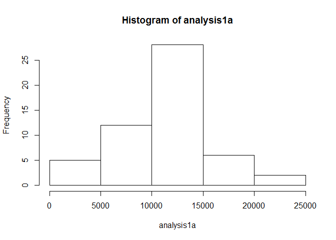
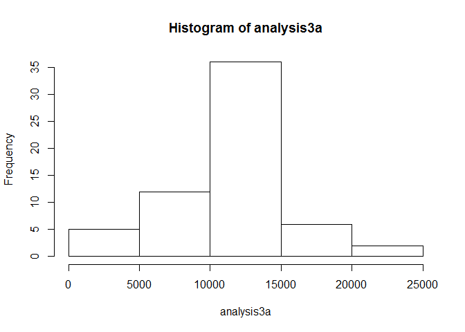

# Reproducible Research: Peer Assessment 1


## Loading and preprocessing the data
> N.B. Data are located in a subdirectory called */data*.

[//]: # (setwd("D:/Desktop/Data Science Classes/Reproducible Research/Assessment1/Week 1"))

We load data from the data subdirectory. All other preprocessing varies according to the
question, and is performed per step.

```r
library(lattice)
dataFile <- "Data/activity.csv"
data <- read.csv(dataFile)
```

## What is mean and median total number of steps taken per day?

```r
analysis1a <- tapply(data$steps, data$date, FUN=sum)
hist(analysis1a)
```

 

```r
dayMean1a <- mean(analysis1a, na.rm = TRUE)
dayMedian1a <- median(analysis1a, na.rm = TRUE)
```
The mean total number of steps taken per day is 1.0766189\times 10^{4} and the median is 10765.

## What is the average daily activity pattern?
We will make a time series plot of the 5-minute interval (x-axis) and the average number of steps taken, averaged across all days (y-axis). Missing data are ignored.


```r
stepsPerInterval <- aggregate(data$steps ~ data$interval, data, mean)
plot(stepsPerInterval,
     type="l",
     xlab = "Interval",
     ylab = "Number of Steps")
```

 

## "Which 5-minute interval, on average across all the days in the dataset, contains the maximum number of steps?"

```r
maxNumOfSteps <- max(stepsPerInterval["data$steps"], na.rm = TRUE)
intervalWithMaxAvgSteps <- stepsPerInterval[which(stepsPerInterval["data$steps"] == maxNumOfSteps),1]
```
The 5 minute interval with the maximum average number of steps starts 835 minutes into the day.

## Imputing missing values
We first calculate and report the total number of missing values in the dataset (i.e. the total number of rows with NAs)

```r
numberOfNAs <- sum(!complete.cases(data))
```
There are 2304 missing data values in the set.

Next, we devise a strategy for filling in all of the missing values in the dataset. We use the mean for that 5-minute interval.
We start by creating a new dataset that is equal to the original dataset but with the missing data filled in.

```r
imputedData <- data
for ( ndx in 1:nrow(imputedData)) if ( is.na(imputedData[ndx,1]) ) imputedData[ndx,1] <- stepsPerInterval[which(stepsPerInterval$`data$interval`==imputedData[ndx,3]),2]
```

Next, we make a histogram of the total number of steps taken each day and Calculate and report the mean and median total number of steps taken per day. Do these values differ from the estimates from the first part of the assignment? What is the impact of imputing missing data on the estimates of the total daily number of steps?

```r
analysis3a <- tapply(imputedData$steps, imputedData$date, FUN=sum)
hist(analysis3a)
```

 

Finally, we compute the Mean and the Median...

```r
dayMean3a <- mean(analysis3a, na.rm = TRUE)
```
...and the Median

```r
dayMedian3a <- median(analysis3a, na.rm = TRUE)
```
The mean total number of steps taken per day is 1.0766189\times 10^{4} and the median is 1.0766189\times 10^{4}.


## Are there differences in activity patterns between weekdays and weekends?
We will create a new factor variable in the dataset with two levels -- "weekday" and "weekend" indicating whether a given date is a weekday or weekend day.

```r
data4 <- imputedData
data4$date <- as.POSIXlt(data4$date)
data4$dayType <- ifelse ( data4$date$wday %in% c(0,6),"weekend","weekday")
data4$dayType <- as.factor(data4$dayType)
```

And finally present a panel plot containing a time series plot (i.e. type = "l") of the 5-minute interval (x-axis) and the average number of steps taken, averaged across all weekday days or weekend days (y-axis).

```r
stepsPerInterval2 <- aggregate(data4$steps ~ data4$interval*data4$dayType, data4, mean)
xyplot(stepsPerInterval2$`data4$steps`~stepsPerInterval2$`data4$interval`|stepsPerInterval2$`data4$dayType`,
       layout=(c(1,2)),
       type="l",
       xlab = "Interval",
       ylab = "Number of Steps")
```

 
